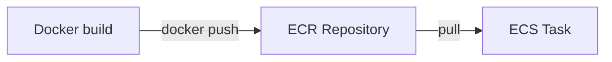

# ECR Theory

## 1. Concept Overview

**Amazon Elastic Container Registry (ECR)** is a private Docker image registry hosted by AWS. Push images from your laptop/CI; ECS pulls images to run containers.

---

## 2. Why DevOps Engineers Use ECR

- Same AWS account/region as ECS — fast pulls
- IAM controls who can push/pull
- Integrated with ECS task definitions

---

## 3. Important Terms

| Term | Meaning |
|------|---------|
| **Repository** | Stores images (e.g. `devops-lab-app`) |
| **Image tag** | Version label (`latest`, `v1`) |
| **URI** | `account.dkr.ecr.region.amazonaws.com/repo:tag` |

---

## 4. Architecture Diagram



---

## 5. Before You Start

Docker Desktop or Docker in Git Bash/WSL.

> **Cost warning:** ECR storage ~$0.10/GB-month — small for lab images.

---

## 6. Concept — Sample Dockerfile (local, not AWS)

Create on laptop `app/` folder:

```dockerfile
FROM nginx:alpine
COPY index.html /usr/share/nginx/html/index.html
```

`index.html`:

```html
<h1>devops-lab-<yourname> — ECS Fargate</h1>
```

Build locally:

```bash
docker build -t devops-lab-<yourname>-app .
```

---

## 10. Interview Questions

1. **ECR vs Docker Hub?**
   - *ECR private AWS-integrated; Docker Hub public/default registry.*

---

## 11. What We Achieved

- Understood ECR and image push flow

**Next:** [03-create-ecr-repo.md](03-create-ecr-repo.md)
