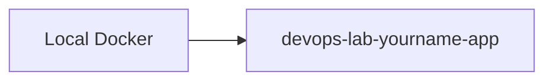

# Create ECR Repository

## 1. Concept Overview

Create ECR repo and push sample nginx Docker image from your machine.

**Repository name:** `devops-lab-<yourname>-app`

---

## 2. Why DevOps Engineers Push to ECR

ECS task definitions reference ECR image URI — deployment pipeline artifact.

---

## 3. Important Terms

**Login token** — `aws ecr get-login-password` (Console also shows push commands).

---

## 4. Architecture Diagram



---

## 5. Before You Start

Docker running. IAM user with ECR/ECS permissions (admin group OK).

> **Cost warning:** Minimal storage cost.

---

## 6. Step-by-Step Console Lab

### Create repository

1. **ECR** → **Repositories** → **Create repository**
2. **Visibility:** Private
3. **Name:** `devops-lab-<yourname>-app`
4. **Scan on push:** optional
5. **Encryption:** AES-256
6. **Create repository**
7. Click repository → **View push commands**

### Push image (from laptop — Git Bash)

Follow ECR push commands (replace placeholders):

```bash
# 1. Authenticate Docker to ECR
aws ecr get-login-password --region ap-southeast-1 | docker login --username AWS --password-stdin <ACCOUNT_ID>.dkr.ecr.ap-southeast-1.amazonaws.com

# 2. Build (from folder with Dockerfile)
docker build -t devops-lab-<yourname>-app .

# 3. Tag
docker tag devops-lab-<yourname>-app:latest <ACCOUNT_ID>.dkr.ecr.ap-southeast-1.amazonaws.com/devops-lab-<yourname>-app:latest

# 4. Push
docker push <ACCOUNT_ID>.dkr.ecr.ap-southeast-1.amazonaws.com/devops-lab-<yourname>-app:latest
```

> **Note:** Requires AWS CLI configured — if not yet in Module 04, use **ECR → Push commands** in Console and ask instructor for temporary CLI setup OR use sample public image `nginx:alpine` in task definition (skip push) — prefer ECR push for full lab.

### Verify in Console

Refresh ECR — image tag `latest` appears.

---

## 7. Validation

| Check | Expected |
|-------|----------|
| ECR repo | Image with tag latest |

---

## 8. Troubleshooting

| Problem | Solution |
|---------|----------|
| docker login fail | CLI not configured — complete CLI setup or use instructor account ID |
| denied | IAM ecr permissions |

---

## 9. Cleanup

[cleanup.md](cleanup.md)

---

## 10. Interview Questions

1. **How does ECS authenticate to ECR?**
   - *Task execution IAM role with ECR pull permissions.*

---

## 11. What We Achieved

- ECR repository with pushed image

**Next:** [04-create-ecs-cluster.md](04-create-ecs-cluster.md)
