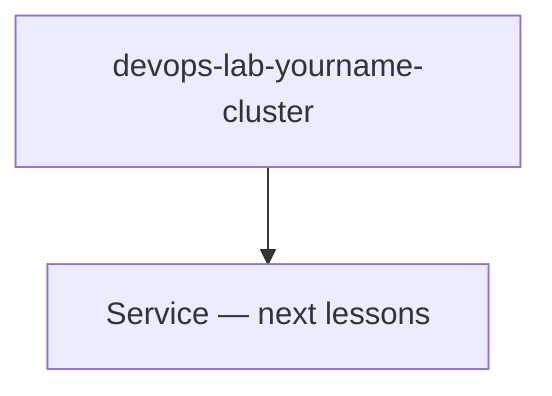

# Create ECS Cluster

## 1. Concept Overview

**ECS cluster** is a logical boundary for running tasks and services. With **Fargate**, no EC2 instances to register.

**Cluster name:** `devops-lab-<yourname>-cluster`

---

## 2. Why DevOps Engineers Use Clusters

Separate dev/stage/prod workloads; monitoring and capacity boundaries.

---

## 3. Important Terms

**Fargate** — serverless compute engine for ECS.

---

## 4. Architecture Diagram

---

## 5. Before You Start

> **Cost warning:** Cluster free; tasks cost when running.

---

## 6. Step-by-Step Console Lab

1. **ECS** → **Clusters** → **Create cluster**
2. **Cluster name:** `devops-lab-<yourname>-cluster`
3. **Infrastructure:** **AWS Fargate (serverless)** only — uncheck EC2 if shown
4. **Monitoring:** optional Container Insights (may add cost — skip for lab)
5. **Tags:** `Project=aws-basic-lab`
6. **Create**
7. Wait cluster **Active**

---

## 7. Validation

| Check | Expected |
|-------|----------|
| Cluster | Active, 0 services |

---

## 8. Troubleshooting

| Problem | Solution |
|---------|----------|
| Fargate not available | Check Region support |

---

## 9. Cleanup

[cleanup.md](cleanup.md)

---

## 10. Interview Questions

1. **Is ECS cluster a VM?**
   - *No — logical grouping; Fargate runs tasks without you managing VMs.*

---

## 11. What We Achieved

- Fargate ECS cluster created

**Next:** [05-create-task-definition.md](05-create-task-definition.md)
