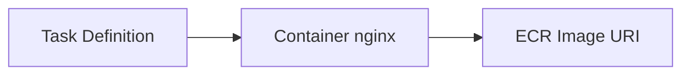

# Create Task Definition

## 1. Concept Overview

**Task definition** specifies container image, CPU/memory, ports, logging, and IAM roles.

**Family name:** `devops-lab-<yourname>-task`

---

## 2. Why DevOps Engineers Version Task Definitions

Each change creates new revision — rollback by deploying old revision.

---

## 3. Important Terms

| Term | Meaning |
|------|---------|
| **Task execution role** | Pulls image, writes logs — use `ecsTaskExecutionRole` |
| **Task role** | Permissions inside container (optional) |
| **Container port** | 80 for nginx |

---

## 4. Architecture Diagram

---

## 5. Before You Start

ECR image URI ready. If no push yet, use `public.ecr.aws/docker/library/nginx:alpine` for lab fallback.

> **Cost warning:** Tasks bill when service runs.

---

## 6. Step-by-Step Console Lab

1. **ECS** → **Task definitions** → **Create new task definition** → **Create new task definition with JSON** OR form wizard

### Form wizard (recommended)

1. **Task definition family:** `devops-lab-<yourname>-task`
2. **Launch type:** AWS Fargate
3. **OS/Architecture:** Linux / X86_64
4. **Task size:** **0.25 vCPU**, **0.5 GB** memory (smallest Fargate — verify minimum in console)
5. **Task roles:**
   - **Task execution role:** Create new role or select **ecsTaskExecutionRole** (Console can create with `AmazonECSTaskExecutionRolePolicy`)
6. **Container — Add container:**
   - **Name:** `web`
   - **Image URI:** `<ACCOUNT_ID>.dkr.ecr.ap-southeast-1.amazonaws.com/devops-lab-<yourname>-app:latest`
   - **Essential:** Yes
   - **Port mappings:** Container port **80**, protocol TCP, **App protocol HTTP**
   - **Environment:** optional
7. **Logging:** AWS logs — create log group `/ecs/devops-lab-<yourname>` (optional)
8. **Create**

---

## 7. Validation

| Check | Expected |
|-------|----------|
| Task definition | Revision 1 active |
| Image URI | Correct ECR path |

---

## 8. Troubleshooting

| Problem | Solution |
|---------|----------|
| Cannot create execution role | Use admin IAM or ask instructor |
| Fargate CPU/memory invalid | Pick allowed combo from console dropdown |

---

## 9. Cleanup

Delete service first in later cleanup.

---

## 10. Interview Questions

1. **Task execution role vs task role?**
   - *Execution: pull image/logs; Task: app AWS API access.*

---

## 11. What We Achieved

- Fargate task definition with container port 80

**Next:** [06-create-service-with-alb.md](06-create-service-with-alb.md)
