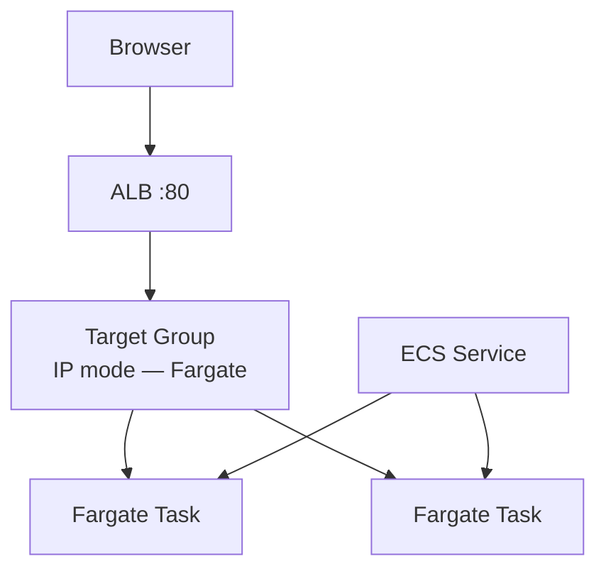

# Create Service with ALB

## 1. Concept Overview

**ECS service** runs and maintains tasks. Connect to **new ALB** so users hit load balancer → Fargate tasks.

**Service name:** `devops-lab-<yourname>-service`

---

## 2. Why DevOps Engineers Use ALB with ECS

Stable DNS URL, health checks, future HTTPS, multi-task load distribution.

---

## 3. Important Terms

| Resource | Name |
|----------|------|
| ALB | `devops-lab-<yourname>-ecs-alb` |
| Target group | `devops-lab-<yourname>-ecs-tg` |
| ECS SG | `devops-lab-<yourname>-ecs-sg` |

---

## 4. Architecture Diagram

---

## 5. Before You Start

Cluster and task definition ready. Default VPC with 2 AZs.

> **Cost warning:** Fargate tasks + ALB — highest lab combo. **Delete today.**

---

## 6. Step-by-Step Console Lab

### Step 1 — Create security group for tasks

1. **EC2** → **Security Groups** → **Create**
2. **Name:** `devops-lab-<yourname>-ecs-sg`
3. **VPC:** default
4. **Inbound:** HTTP **80** — source will be ALB SG (create ALB SG first)

**ALB SG** `devops-lab-<yourname>-ecs-alb-sg`:
- HTTP 80 from `0.0.0.0/0`

**ECS task SG** `devops-lab-<yourname>-ecs-sg`:
- HTTP 80 from **source: ecs-alb-sg** (SG-to-SG)

### Step 2 — Create ECS service with ALB (wizard)

1. **ECS** → **Clusters** → `devops-lab-<yourname>-cluster`
2. **Services** tab → **Create**
3. **Compute options:** Launch type **Fargate**
4. **Application type:** Service
5. **Task definition:** `devops-lab-<yourname>-task` latest
6. **Service name:** `devops-lab-<yourname>-service`
7. **Desired tasks:** **2**
8. **Networking:**
   - VPC: default
   - Subnets: select **2 AZs** (public subnets OK for Fargate with public IP)
   - **Security group:** `devops-lab-<yourname>-ecs-sg`
   - **Public IP:** **Turned on** (for simple lab in default VPC without NAT)
9. **Load balancing:**
   - **Use load balancing:** Application Load Balancer
   - **Create new load balancer**
   - **Name:** `devops-lab-<yourname>-ecs-alb`
   - **Listener:** HTTP 80
   - **Target group name:** `devops-lab-<yourname>-ecs-tg`
   - **Health check path:** `/`
   - **Target type:** IP (default for Fargate)
10. **Create** — wait service **Active**, tasks **RUNNING**, targets **healthy**

### Step 3 — Test in browser

1. **EC2** → **Load Balancers** → copy DNS of `devops-lab-<yourname>-ecs-alb`
2. Open `http://<alb-dns>`
3. See nginx / custom page

### Step 4 — Scale test (optional)

1. **Service** → **Update** → desired tasks **3** → wait new task healthy
2. Refresh browser

---

## 7. Validation

| Check | Expected |
|-------|----------|
| Service | Active, 2/2 running |
| Target group | 2 healthy targets |
| ALB URL | HTTP 200, page loads |

---

## 8. Troubleshooting

| Problem | Solution |
|---------|----------|
| Tasks cannot pull image | Execution role needs ECR permissions; check image URI |
| Unhealthy targets | SG must allow ALB → task on port 80; container listens 80 |
| CannotPullContainerError | Wrong tag or repo name |
| Timeout on ALB | Public IP disabled on task without NAT — enable public IP for lab |

---

## 9. Cleanup

[cleanup.md](cleanup.md) **immediately after test**.

---

## 10. Interview Questions

1. **Why Fargate target type IP?**
   - *Tasks get ENI IPs registered directly in target group.*

2. **ECS service vs task?**
   - *Service maintains desired count; task is one running instance of definition.*

---

## 11. What We Achieved

- ECS Fargate service behind ALB serving containerized web app
- End-to-end container deployment on AWS

**Next:** [cleanup.md](cleanup.md)
