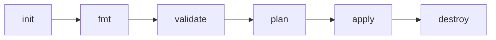

# Terraform Workflow

## Learning Goal

Master the six core Terraform commands used in every lab.

---

## Command Flow



---

## 1. terraform init

Downloads AWS provider plugins. Run **once per lab folder** (and after adding providers).

```bash
cd labs/01-ec2-default-vpc
terraform init
```

**Expected:**

```
Terraform has been successfully configured!
```

Creates `.terraform/` directory (in `.gitignore`).

---

## 2. terraform fmt

Formats `.tf` files to standard style.

```bash
terraform fmt
```

Run before commit in real teams.

---

## 3. terraform validate

Checks syntax and internal consistency (no AWS calls).

```bash
terraform validate
```

**Expected:** `Success! The configuration is valid.`

---

## 4. terraform plan

Preview changes — **always run before apply**.

```bash
terraform plan
```

Shows:

- `+` create
- `~` update
- `-` destroy

With tfvars:

```bash
terraform plan -var-file="terraform.tfvars"
```

---

## 5. terraform apply

Creates or updates infrastructure.

```bash
terraform apply
```

Type `yes` when prompted, or:

```bash
terraform apply -auto-approve
```

**Cost warning:** This bills your AWS account.

---

## 6. terraform destroy

Deletes all resources in the state file.

```bash
terraform destroy
```

Type `yes` or:

```bash
terraform destroy -auto-approve
```

**Always run at end of every lab.**

---

## Standard Lab Session (Git Bash)

```bash
export AWS_PROFILE=aws-basic-lab

cd /c/faizul-personal/ntech/module-4/aws-basic/05-terraform/labs/01-ec2-default-vpc

cp terraform.tfvars.example terraform.tfvars
# edit terraform.tfvars — set your IP and name

terraform init
terraform fmt
terraform validate
terraform plan
terraform apply
terraform output

# ... test resources ...

terraform destroy
```

---

## Troubleshooting

| Error | Fix |
|-------|-----|
| `Error configuring credentials` | `aws configure --profile aws-basic-lab` |
| `Invalid provider configuration` | `terraform init` again |
| `state lock` | No lock in local labs; wait if using team S3 backend |
| Resource still in AWS after destroy | `terraform state list`; re-import or manual delete |

---

## State Warning

> Do not commit `terraform.tfstate` or `terraform.tfvars` with secrets. See [`.gitignore`](../.gitignore).

---

## What We Achieved

- Learned init → fmt → validate → plan → apply → destroy workflow

**Next:** [06-terraform-labs-same-order-as-console.md](06-terraform-labs-same-order-as-console.md)
