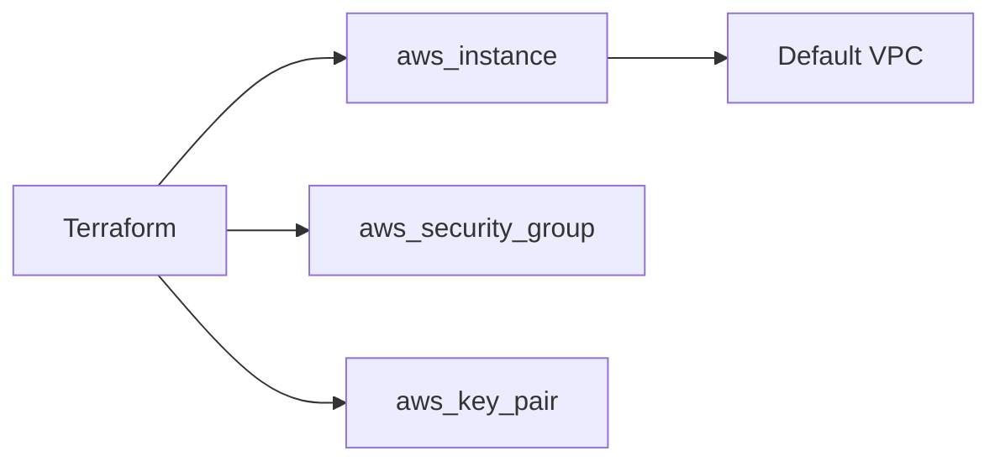

# Terraform Lab 01 — EC2 Default VPC

Repeat [Console lab 02](../../03-console-labs/02-ec2-default-vpc/) using Terraform.

---

## 1. Architecture



---

## 2. Files Explained

| File | Purpose |
|------|---------|
| `versions.tf` | Terraform + AWS provider version, `provider` block with profile |
| `variables.tf` | Region, profile, student name, SSH CIDR |
| `main.tf` | Data sources (VPC, AMI), SG, key pair, EC2 + nginx user_data |
| `outputs.tf` | Public IP, SSH command, HTTP URL |
| `terraform.tfvars.example` | Template — copy to `terraform.tfvars` |

> **State warning:** Do not commit `terraform.tfstate` or `terraform.tfvars`. See repo [`.gitignore`](../../../.gitignore).

---

## 3. Commands to Run

```bash
export AWS_PROFILE=aws-basic-lab
cd 05-terraform/labs/01-ec2-default-vpc

cp terraform.tfvars.example terraform.tfvars
# Edit: student_name, allowed_ssh_cidr (curl https://checkip.amazonaws.com)

terraform init
terraform fmt
terraform validate
terraform plan
terraform apply
```

---

## 4. Expected Output

After `apply`:

```
Apply complete! Resources: 5 added, 0 changed, 0 destroyed.

Outputs:
http_url = "http://54.x.x.x"
public_ip = "54.x.x.x"
ssh_command = "ssh -i devops-lab-yourname-tf-key.pem ec2-user@54.x.x.x"
```

---

## 5. Validation

```bash
terraform output http_url
curl $(terraform output -raw http_url)

# Or SSH
eval $(terraform output -raw ssh_command | sed 's/^ssh/ssh -o StrictHostKeyChecking=accept-new/')
```

Browser: open `http_url` from output.

---

## 6. Cleanup

```bash
terraform destroy
rm -f devops-lab-*-tf-key.pem
```

Verify in Console: no running instance with tag `devops-lab-*-tf-web`.

---

## 7. Troubleshooting

| Issue | Fix |
|-------|-----|
| `No valid credential sources` | `aws configure --profile aws-basic-lab` |
| SSH timeout | Update `allowed_ssh_cidr` in tfvars; `terraform apply` |
| Empty public IP | Wait 1 min; check subnet is public |
| `git wants to commit .pem` | Add `*.pem` to `.gitignore` (already in repo root) |

---

## 8. What We Achieved

- Provisioned EC2 in default VPC with Terraform
- Used data sources, variables, outputs, and user_data
- Destroyed stack with `terraform destroy`

**Next:** [../02-custom-vpc-ec2/](../02-custom-vpc-ec2/)
