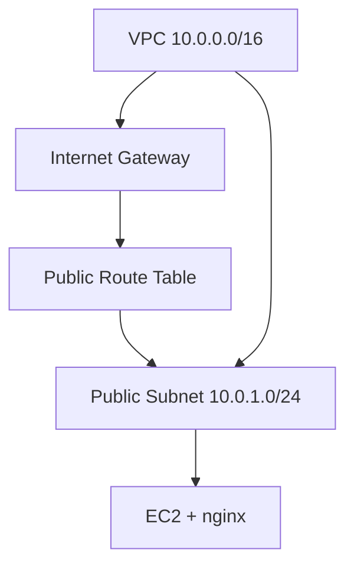

# Terraform Lab 02 — Custom VPC EC2

## 1. Architecture



## 2. Files Explained

| File | Creates |
|------|---------|
| `main.tf` | VPC, subnet, IGW, routes, SG, EC2 |
| `variables.tf` | CIDR, AZ, SSH CIDR |
| `outputs.tf` | VPC ID, URLs |

**No NAT Gateway** — keeps cost low.

## 3. Commands

```bash
cd 05-terraform/labs/02-custom-vpc-ec2
cp terraform.tfvars.example terraform.tfvars
terraform init && terraform fmt && terraform validate
terraform plan && terraform apply
```

## 4. Expected Output

`public_ip`, `http_url`, `vpc_id` in outputs.

## 5. Validation

```bash
curl $(terraform output -raw http_url)
terraform output ssh_command
```

## 6. Cleanup

```bash
terraform destroy
rm -f *.pem
```

## 7. Troubleshooting

| Issue | Fix |
|-------|-----|
| Destroy VPC fails | Run `terraform destroy` again; delete dependencies first |
| No internet | Check route `0.0.0.0/0` → IGW |

## 8. What We Achieved

- Full custom VPC stack as code
- Same result as Console lab 03

**Next:** [../03-ebs/](../03-ebs/)
