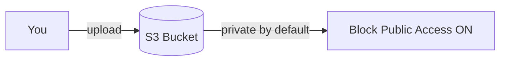

# Capstone Project 01 — Static Website on S3

**Level:** Beginner | **Est. time:** 2–3 hours | **Cost:** Low (pennies for small objects)

Combine skills from **Console**, **CLI**, or **Terraform** S3 labs into one portfolio project.

---

## Goal

Host a simple static HTML page on S3. Understand **static website hosting** concept and **why public access must be controlled**.

---

## What You Will Build

| Component | Purpose |
|-----------|---------|
| S3 bucket | Store `index.html`, optional CSS/images |
| Encryption | SSE-S3 default |
| Block Public Access | ON by default — understand before any public site |
| Optional | Bucket policy for CloudFront later (not required for this project) |

---

## Architecture



**Static website concept:** S3 can serve HTML/CSS/JS without a web server VM. Production often uses **S3 + CloudFront** (CDN), not open public buckets.

---

## Step-by-Step (Console Path)

### 1. Create `index.html` locally

```html
<!DOCTYPE html>
<html>
<head>
  <title>devops-lab-<yourname> — AWS Capstone</title>
  <style>
    body { font-family: sans-serif; max-width: 600px; margin: 2rem auto; }
    h1 { color: #232f3e; }
  </style>
</head>
<body>
  <h1>Hello from S3 Static Site</h1>
  <p>Project by devops-lab-<strong>yourname</strong></p>
  <p>Region: ap-southeast-1</p>
</body>
</html>
```

### 2. Create bucket

- Name: `devops-lab-<yourname>-capstone-web-<random>`
- Region: `ap-southeast-1`
- **Block all public access:** ✅ KEEP ENABLED (this project uses private upload/download unless instructor enables static hosting demo)

### 3. Upload

Console → bucket → **Upload** → `index.html` (prefix `site/`)

### 4. Verify (private)

```bash
aws s3 cp s3://<bucket-name>/site/index.html ./test.html --profile aws-basic-lab
```

Open `test.html` locally in browser.

### 5. Static website hosting (concept only)

Console → bucket → **Properties** → **Static website hosting**:

- Understand it needs public read **or** CloudFront OAC
- **Security warning:** Opening bucket to `0.0.0.0/0` for `GetObject` has caused major data leaks. For this capstone, keep **Block Public Access ON** unless instructor runs a supervised public demo.

---

## CLI Path (Alternative)

```bash
export BUCKET=devops-lab-<yourname>-capstone-$(date +%Y%m)
aws s3 mb s3://$BUCKET --region ap-southeast-1 --profile aws-basic-lab
aws s3 cp index.html s3://$BUCKET/site/index.html --profile aws-basic-lab
aws s3 ls s3://$BUCKET/site/ --profile aws-basic-lab
```

---

## Terraform Path (Alternative)

Copy [05-terraform/labs/04-s3/](../05-terraform/labs/04-s3/) and add `aws_s3_object` for `index.html` with `source = "index.html"`.

---

## Validation Checklist

- [ ] Bucket in `ap-southeast-1`
- [ ] `index.html` uploaded
- [ ] Block Public Access enabled
- [ ] Encryption enabled
- [ ] Can download object via CLI as owner

---

## Cleanup

```bash
aws s3 rb s3://<bucket-name> --force --profile aws-basic-lab --region ap-southeast-1
```

Or `terraform destroy` if using Terraform.

Verify bucket gone in Console.

---

## What You Achieved

- Built a static site **asset pipeline** to S3
- Understood static hosting vs secure private buckets

**Next:** [project-02-ec2-nginx-custom-vpc.md](project-02-ec2-nginx-custom-vpc.md)
