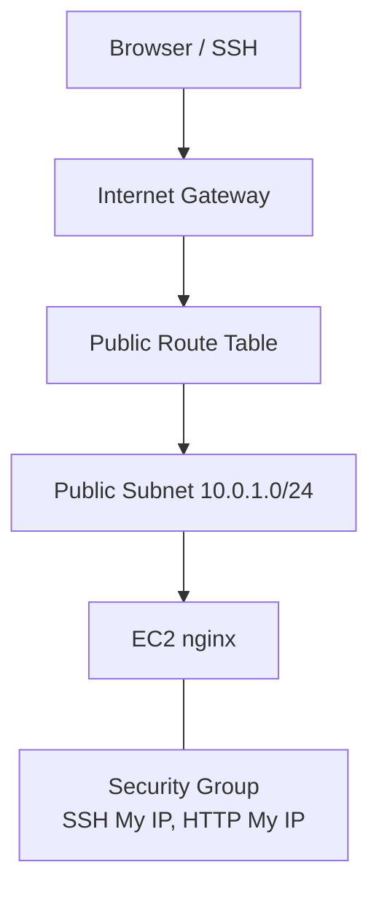

# Capstone Project 02 — Nginx on EC2 in Custom VPC

**Level:** Beginner–Intermediate | **Est. time:** 3–4 hours | **Cost:** Low (EC2 `t3.micro`)

End-to-end project: **custom VPC**, **public subnet**, **IGW**, **routing**, **EC2**, **security group**, **nginx**, **browser test**.

---

## Goal

Prove you can build a secure, internet-reachable web server on a network **you designed** — not the default VPC.

---

## Architecture



---

## Resource Naming

| Resource | Name |
|----------|------|
| VPC | `devops-lab-<yourname>-capstone-vpc` |
| CIDR | `10.0.0.0/16` |
| Public subnet | `10.0.1.0/24` in `ap-southeast-1a` |
| EC2 | `devops-lab-<yourname>-capstone-web` |

---

## Build Options

| Method | Reference |
|--------|-----------|
| **Console** | [03-console-labs/03-custom-vpc-ec2/](../03-console-labs/03-custom-vpc-ec2/) |
| **CLI** | [04-aws-cli/commands/custom-vpc-ec2.md](../04-aws-cli/commands/custom-vpc-ec2.md) |
| **Terraform** | [05-terraform/labs/02-custom-vpc-ec2/](../05-terraform/labs/02-custom-vpc-ec2/) |

---

## Security Requirements

| Rule | Setting |
|------|---------|
| SSH (22) | **My IP** only — not `0.0.0.0/0` |
| HTTP (80) | **My IP** for lab test (or ALB in production) |
| RDS/NAT | Do not create NAT Gateway |

---

## Step-by-Step Summary (Console)

1. Create VPC `10.0.0.0/16`
2. Public subnet `10.0.1.0/24`, auto-assign public IP
3. Internet Gateway → attach to VPC
4. Route table: `0.0.0.0/0` → IGW
5. Security group: SSH + HTTP from My IP
6. Launch `t3.micro` Amazon Linux 2023
7. SSH → install nginx → custom `index.html`
8. Browser: `http://<public-ip>`

```bash
ssh -i <key>.pem ec2-user@<PUBLIC_IP>
sudo dnf install -y nginx
sudo systemctl enable nginx --now
echo "<h1>Capstone VPC — <yourname></h1>" | sudo tee /usr/share/nginx/html/index.html
```

---

## Validation Checklist

- [ ] VPC CIDR correct
- [ ] Public subnet has IGW route
- [ ] EC2 has public IP
- [ ] `curl localhost` on server works
- [ ] Browser loads page from laptop
- [ ] SSH fails from wrong IP (optional test)

---

## Cleanup

**Console:** Follow [03-custom-vpc-ec2/cleanup.md](../03-console-labs/03-custom-vpc-ec2/cleanup.md)

**Terraform:**

```bash
cd 05-terraform/labs/02-custom-vpc-ec2
terraform destroy
```

**CLI:** Run cleanup commands from custom-vpc-ec2 CLI guide.

---

## What You Achieved

- Designed and deployed a custom VPC web stack
- Applied practical security group rules

**Next:** [project-03-ecs-web-app-with-alb.md](project-03-ecs-web-app-with-alb.md)
