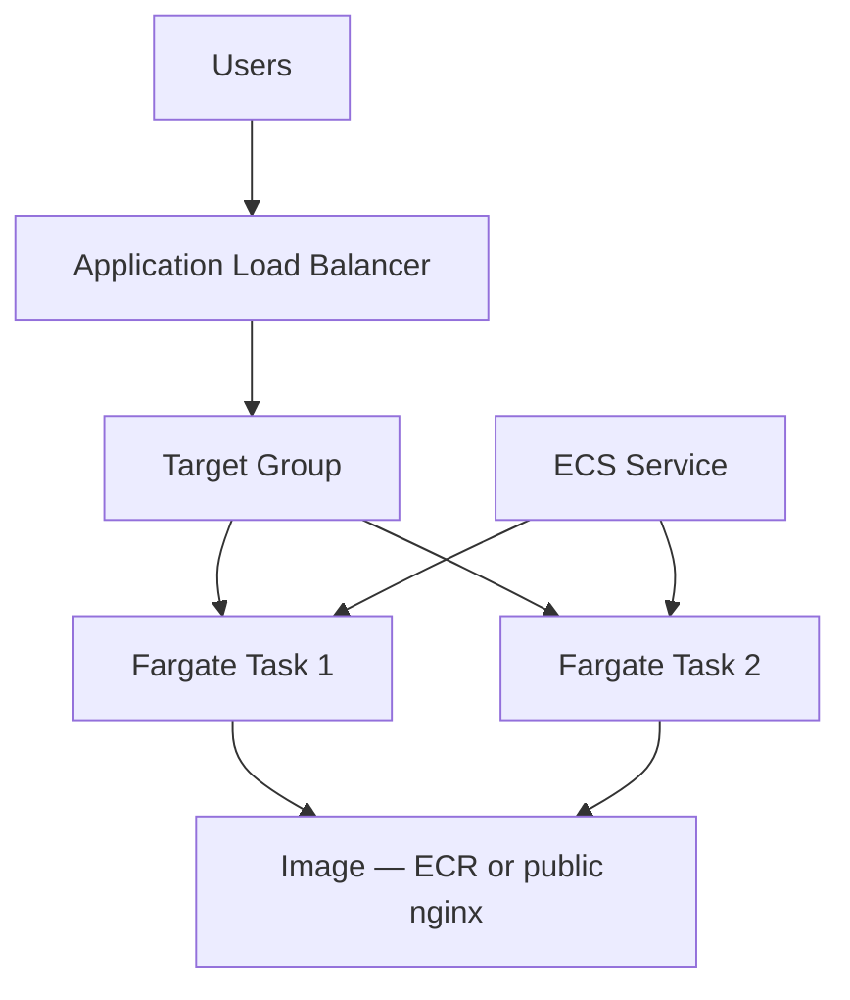

# Capstone Project 03 — Container Web App on ECS with ALB

**Level:** Intermediate | **Est. time:** 4–5 hours | **Cost:** Medium (Fargate + ALB — **destroy same day**)

Final project: **ECR**, **ECS Fargate**, **task definition**, **service**, **ALB**, **target group**, **health checks**.

---

## Goal

Run a containerized web app on AWS the way many DevOps teams deploy microservices — load balanced and scalable.

---

## Architecture



---

## Components Checklist

| Component | Your resource name pattern |
|-----------|---------------------------|
| ECR repo | `devops-lab-<yourname>-capstone-app` |
| ECS cluster | `devops-lab-<yourname>-capstone-cluster` |
| Task definition | nginx container port 80 |
| Service | desired count = 2 |
| ALB | internet-facing HTTP:80 |
| Target group | health check path `/` |
| ECS SG | HTTP from ALB SG only |

---

## Build Paths

| Method | Reference |
|--------|-----------|
| **Console** | [03-console-labs/08-ecs/](../03-console-labs/08-ecs/) |
| **CLI** | [04-aws-cli/commands/ecs.md](../04-aws-cli/commands/ecs.md) |
| **Terraform** | [05-terraform/labs/07-ecs/](../05-terraform/labs/07-ecs/) |

---

## Recommended Flow (Console)

1. Build Docker image locally (`nginx` + custom `index.html`)
2. Create ECR repo → push image
3. Create ECS cluster (Fargate)
4. Create task definition (0.25 vCPU, 0.5 GB, execution role)
5. Create ALB + target group (IP type for Fargate)
6. Create ECS service (2 tasks, public IP in default VPC for lab)
7. Open ALB DNS in browser
8. Optional: stop one task → verify ALB still serves traffic

---

## Docker Quick Start

```bash
mkdir capstone-ecs && cd capstone-ecs
echo '<h1>ECS Capstone — yourname</h1>' > index.html
cat > Dockerfile << 'EOF'
FROM nginx:alpine
COPY index.html /usr/share/nginx/html/index.html
EOF
docker build -t capstone-app .
```

Push to ECR using push commands from Console.

---

## Validation Checklist

- [ ] ECR has `latest` image (or public image for simplified path)
- [ ] ECS service: 2/2 tasks RUNNING
- [ ] Target group: 2 healthy
- [ ] `curl http://<alb-dns>` returns HTML
- [ ] Health check path `/` passing

---

## Cleanup

Follow [03-console-labs/08-ecs/cleanup.md](../03-console-labs/08-ecs/cleanup.md) or:

```bash
terraform destroy   # in labs/07-ecs
```

Delete: service → ALB → TG → cluster → ECR → SGs.

---

## Cost Warning

> ALB + Fargate left running overnight can cost **$5–20+ USD**. Destroy immediately after demo.

---

## What You Achieved

- Deployed containerized app on AWS with load balancing
- Completed the Console → CLI → Terraform learning arc

**Final step:** [final-cleanup-checklist.md](final-cleanup-checklist.md)
