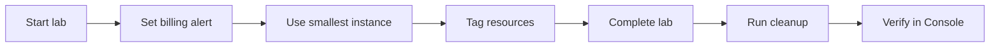

# Cost and Safety Guide

A practical reference for **avoiding surprise AWS bills** and **keeping your account secure** throughout this course.

**Default lab region:** `ap-southeast-1` (Singapore)

---

## 1. Core Principle

> **If a resource exists in AWS, it probably costs money.**

Your job as a DevOps learner is to:

1. Create only what the lab requires
2. Use the **smallest** size that works
3. **Delete everything** when the lab ends
4. Never commit credentials to Git

---

## 2. AWS Free Tier — What It Actually Means

| Type | Meaning |
|------|---------|
| **12-month Free Tier** | New accounts: limited hours/storage for 12 months (e.g. 750 hrs/month `t3.micro` Linux) |
| **Always Free** | Small monthly limits that never expire (e.g. Lambda requests) |
| **Short trials** | Time-limited trials for specific services |

**Free Tier does NOT cover everything in this course.**

| Service | Free Tier note |
|---------|----------------|
| EC2 `t3.micro` | Often 750 hrs/month first 12 months |
| S3 | 5 GB standard storage (limits apply) |
| RDS | Limited — check current offers |
| **ALB** | **Not Free Tier friendly** — hourly charge |
| **NAT Gateway** | **Never use in beginner labs** — expensive |
| **Fargate** | Limited; still costs at scale |

Always check: [AWS Free Tier](https://aws.amazon.com/free/)

---

## 3. Set Up Billing Alerts (Do This on Day 1)

See [00-course-setup/aws-account-safety.md](00-course-setup/aws-account-safety.md).

| Alert | Suggested amount |
|-------|------------------|
| AWS Budget | $10 USD/month (training) |
| Thresholds | 80% and 100% email |

Review weekly: **Billing** → **Cost Explorer** → filter by service.

---

## 4. Cost Estimate by Module

Approximate if **not** on Free Tier and left running **24 hours**:

| Module | Main resources | Risk if forgotten |
|--------|----------------|-------------------|
| 03 IAM | None | Free |
| 03 EC2 | `t3.micro` | ~$8–12/month |
| 03 VPC | VPC free; EC2 costs | EC2 charges |
| 03 EBS | Volume GB-month | Cents–$1+ |
| 03 S3 | Storage + requests | Low if small |
| 03 RDS | `db.t3.micro` + storage | **$15–25+/month** |
| 03 ALB+ASG | ALB + 2× EC2 | **$25–40+/month** |
| 03 ECS | Fargate + ALB | **$20–35+/month** |
| 04–05 CLI/Terraform | Same as Console | Same risks |
| 06 Capstone | Combined | Medium–high |

**Rule:** Run cleanup **same day** as each lab.

**Between modules:** Console → CLI → Terraform repeats the same services. Run [final-cleanup-checklist.md](06-capstone-project/final-cleanup-checklist.md) (or verify zero lab resources) before starting the next module — otherwise you pay for duplicate stacks.

**Console exception:** Defer Lab 02 EC2 cleanup until after Lab 04 EBS — see [03-console-labs/README.md](03-console-labs/README.md).

---

## 5. Highest-Cost Mistakes (Student Hall of Fame)

| Mistake | Why it hurts |
|---------|--------------|
| Forgotten RDS instance | Bills 24/7 — often #1 surprise |
| ALB left running | ~$0.025/hr + usage even with no traffic |
| NAT Gateway created | ~$0.045/hr + per-GB — avoid in this course |
| Multiple EC2 instances from ASG | 2× or more compute cost |
| EBS volumes after terminate | Unattached volumes still charge |
| Elastic IP not released | Charge when not attached to running instance |
| Wrong region resources | Hard to find; keeps billing |
| Snapshots accumulating | Small but never-ending storage cost |

---

## 6. Resource Cleanup Quick Reference

| Service | How to stop charges |
|---------|---------------------|
| **EC2** | Terminate instance (not just Stop if lab done) |
| **EBS** | Delete volumes; delete snapshots |
| **Elastic IP** | Release if unused |
| **RDS** | Delete instance; delete snapshots |
| **ALB** | Delete load balancer |
| **Target group** | Delete after ALB |
| **ASG** | Delete group (terminates instances) |
| **ALB base EC2** | Terminate `alb-base` after AMI created (Console lab 07) |
| **ECS** | Delete service → cluster |
| **ECR** | Delete images → repository |
| **CloudWatch Logs** | Delete `/ecs/devops-lab-*` log groups |
| **S3** | Empty bucket (all versions) → delete bucket |
| **NAT Gateway** | Delete NAT → release EIP |
| **Custom VPC** | Delete IGW, subnets, RT, VPC (order matters) |

Detailed checklists:

- Per lab: each `03-console-labs/*/cleanup.md`
- End of course: [06-capstone-project/final-cleanup-checklist.md](06-capstone-project/final-cleanup-checklist.md)

---

## 7. Tagging for Cost Control

Required tags (see [lab-naming-convention.md](00-course-setup/lab-naming-convention.md)):

```
Project     = aws-basic
Owner       = <yourname>
Environment = training
```

In **Cost Explorer**, group by tag `Owner` or `Project` to see your spend.

---

## 8. Credential Safety

| Never commit | Store instead |
|--------------|---------------|
| Access Key ID + Secret | `~/.aws/credentials` |
| `.pem` SSH keys | `~/.ssh/` |
| `terraform.tfstate` | Local only (sensitive) |
| `terraform.tfvars` with passwords | Local only |
| IAM CSV download | Password manager, then delete file |

Repo [`.gitignore`](.gitignore) blocks common mistakes.

If you **accidentally commit a key**:

1. **Revoke/delete key immediately** in IAM
2. Create new key
3. Remove from Git history (or rotate and treat as compromised)
4. Check CloudTrail for unauthorized API calls

---

## 9. Network Security vs Cost

| Practice | Cost impact | Security |
|----------|-------------|----------|
| SSH from **My IP** only | Free | ✅ Good |
| SSH from `0.0.0.0/0` | Free | ❌ Bad — attacks |
| HTTP from My IP for lab | Free | ✅ OK for learning |
| Public S3 bucket | Free tier storage | ❌ Data leak risk |
| NAT Gateway for private subnet | **$$$** | Production pattern — not this course |

---

## 10. Region Discipline

| Do | Don't |
|----|-------|
| Use `ap-southeast-1` for all labs | Mix regions without reason |
| Check top-right region before create | Assume resources are "everywhere" |
| Run cleanup in **each** region used | Only check one region |

```bash
# List EC2 regions with running instances (CLI)
for r in ap-southeast-1 us-east-1 eu-west-1; do
  echo "=== $r ==="
  aws ec2 describe-instances --region $r --profile aws-basic-lab \
    --query "Reservations[].Instances[?State.Name=='running'].InstanceId" --output text
done
```

---

## 11. Terraform State Safety

> **`terraform.tfstate` can contain sensitive values** (IPs, resource IDs, sometimes secrets).

| Rule | Action |
|------|--------|
| Do not commit state | In `.gitignore` |
| One state per lab folder | Do not share state casually |
| After `destroy` | State should show zero resources |
| Production | Use remote S3 backend + encryption (advanced) |

---

## 12. Daily Lab Cost Habits



| Before lab | After lab |
|------------|-----------|
| Confirm region | Terminate/delete resources |
| Confirm budget alert | Check Cost Explorer tomorrow |
| Read cost warning in README | Run `terraform destroy` if used |

---

## 13. When to Ask for Help

Contact instructor if:

- Bill exceeds expected amount suddenly
- Cannot find resource to delete
- `terraform destroy` fails halfway
- Suspect account compromise (unknown resources, unknown API calls)

---

## 14. Quick Rules Summary

1. **Always run cleanup** at end of every lab
2. **Terminate** EC2 — don't leave running overnight
3. **Delete RDS and ALB** same day — highest risk
4. **No NAT Gateway** in beginner labs
5. **Use `t3.micro` / `db.t3.micro`**
6. **Region:** `ap-southeast-1` unless told otherwise
7. **Never commit** keys, `.pem`, or `tfstate`
8. **MFA on root** and IAM lab user
9. **Billing budget** at $10 (or agreed amount)
10. **Final sweep:** [final-cleanup-checklist.md](06-capstone-project/final-cleanup-checklist.md)

---

## References to Verify

- [AWS Pricing Calculator](https://calculator.aws/)
- [AWS Cost Management](https://aws.amazon.com/aws-cost-management/)
- [AWS Free Tier](https://aws.amazon.com/free/)
- [AWS Security Best Practices](https://aws.amazon.com/architecture/security-identity-compliance/)

---

**Related:** [00-course-setup/aws-account-safety.md](00-course-setup/aws-account-safety.md) | [lab-naming-convention.md](00-course-setup/lab-naming-convention.md)
