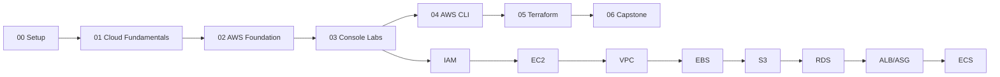

# Course Roadmap

Phase-wise learning path for **AWS Basic for DevOps Professionals**.

## Overview

| Phase | Module | Focus | Est. Time | Cost Risk |
|-------|--------|-------|-----------|-----------|
| 0 | [00-course-setup](00-course-setup/) | Prerequisites, account safety, naming | 1–2 hours | Low |
| 1 | [01-cloud-fundamentals](01-cloud-fundamentals/) | Cloud theory and pricing models | 3–4 hours | None (theory) |
| 2 | [02-aws-foundation](02-aws-foundation/) | AWS architecture, security, frameworks | 4–5 hours | None (theory) |
| 3 | [03-console-labs](03-console-labs/) | Console hands-on (IAM → ECS) | 20–25 hours | Medium–High |
| 4 | [04-aws-cli](04-aws-cli/) | CLI setup + repeat console labs | 10–12 hours | Medium–High |
| 5 | [05-terraform](05-terraform/) | IaC theory + repeat labs in Terraform | 12–15 hours | Medium–High |
| 6 | [06-capstone-project](06-capstone-project/) | End-to-end projects | 8–10 hours | Medium |

**Total estimated time:** ~60–70 hours (classroom + self-study)

---

## Phase 0 — Course Setup

| # | Topic | File | Type |
|---|-------|------|------|
| 0.1 | Student prerequisites | [student-prerequisites.md](00-course-setup/student-prerequisites.md) | Read |
| 0.2 | AWS account safety | [aws-account-safety.md](00-course-setup/aws-account-safety.md) | Read |
| 0.3 | Lab naming convention | [lab-naming-convention.md](00-course-setup/lab-naming-convention.md) | Read |

---

## Phase 1 — Cloud Fundamentals

| # | Topic | File | Type |
|---|-------|------|------|
| 1.1 | What is cloud computing? | [01-what-is-cloud.md](01-cloud-fundamentals/01-what-is-cloud.md) | Theory |
| 1.2 | SaaS, PaaS, IaaS | [02-saas-paas-iaas.md](01-cloud-fundamentals/02-saas-paas-iaas.md) | Theory |
| 1.3 | Public, private, hybrid cloud | [03-public-private-hybrid-cloud.md](01-cloud-fundamentals/03-public-private-hybrid-cloud.md) | Theory |
| 1.4 | On-premises vs cloud | [04-on-prem-vs-cloud.md](01-cloud-fundamentals/04-on-prem-vs-cloud.md) | Theory |
| 1.5 | Cloud pricing basics | [05-cloud-pricing-basics.md](01-cloud-fundamentals/05-cloud-pricing-basics.md) | Theory |
| 1.6 | Diagrams reference | [diagrams.md](01-cloud-fundamentals/diagrams.md) | Reference |

---

## Phase 2 — AWS Foundation

| # | Topic | File | Type |
|---|-------|------|------|
| 2.1 | AWS global infrastructure | [01-aws-global-infrastructure.md](02-aws-foundation/01-aws-global-infrastructure.md) | Theory |
| 2.2 | Region, AZ, edge location | [02-region-az-edge-location.md](02-aws-foundation/02-region-az-edge-location.md) | Theory |
| 2.3 | Well-Architected Framework | [03-aws-well-architected-framework.md](02-aws-foundation/03-aws-well-architected-framework.md) | Theory |
| 2.4 | Cloud Adoption Framework | [04-aws-cloud-adoption-framework.md](02-aws-foundation/04-aws-cloud-adoption-framework.md) | Theory |
| 2.5 | Shared responsibility model | [05-shared-responsibility-model.md](02-aws-foundation/05-shared-responsibility-model.md) | Theory |
| 2.6 | Basic AWS security | [06-basic-aws-security.md](02-aws-foundation/06-basic-aws-security.md) | Theory |
| 2.7 | Diagrams reference | [diagrams.md](02-aws-foundation/diagrams.md) | Reference |

---

## Phase 3 — Console Labs

Same service order for Console, CLI, and Terraform modules.

| # | Lab | Lessons | Est. Time | Cleanup |
|---|-----|---------|-----------|---------|
| 3.1 | [IAM Basics](03-console-labs/01-iam-basics/) | Root vs IAM user, create user, admin group | 2–3 hrs | [cleanup.md](03-console-labs/01-iam-basics/cleanup.md) |
| 3.2 | [EC2 Default VPC](03-console-labs/02-ec2-default-vpc/) | Launch EC2, SSH, nginx, security groups | 3–4 hrs | [cleanup.md](03-console-labs/02-ec2-default-vpc/cleanup.md) |
| 3.3 | [Custom VPC + EC2](03-console-labs/03-custom-vpc-ec2/) | VPC, subnets, IGW, routing, NACL | 4–5 hrs | [cleanup.md](03-console-labs/03-custom-vpc-ec2/cleanup.md) |
| 3.4 | [EBS](03-console-labs/04-ebs/) | Attach volume, mount, snapshot | 2–3 hrs | [cleanup.md](03-console-labs/04-ebs/cleanup.md) |
| 3.5 | [S3](03-console-labs/05-s3/) | Bucket, objects, versioning, policy | 2–3 hrs | [cleanup.md](03-console-labs/05-s3/cleanup.md) |
| 3.6 | [RDS](03-console-labs/06-rds/) | MySQL RDS, connect from EC2, backup | 3–4 hrs | [cleanup.md](03-console-labs/06-rds/cleanup.md) |
| 3.7 | [ALB + Auto Scaling](03-console-labs/07-load-balancer-auto-scaling/) | AMI, ALB, ASG, HA test | 4–5 hrs | [cleanup.md](03-console-labs/07-load-balancer-auto-scaling/cleanup.md) |
| 3.8 | [ECS](03-console-labs/08-ecs/) | ECR, cluster, task, service + ALB | 4–5 hrs | [cleanup.md](03-console-labs/08-ecs/cleanup.md) |

---

## Phase 4 — AWS CLI

| # | Topic | File | Type |
|---|-------|------|------|
| 4.1 | CLI prerequisites | [01-cli-prerequisites.md](04-aws-cli/01-cli-prerequisites.md) | Setup |
| 4.2 | Install CLI (Windows/Git Bash) | [02-install-aws-cli-windows-gitbash.md](04-aws-cli/02-install-aws-cli-windows-gitbash.md) | Setup |
| 4.3 | Create access key | [03-create-access-key.md](04-aws-cli/03-create-access-key.md) | Setup |
| 4.4 | Configure profile | [04-aws-configure-profile.md](04-aws-cli/04-aws-configure-profile.md) | Setup |
| 4.5 | Command cheatsheet | [05-cli-command-cheatsheet.md](04-aws-cli/05-cli-command-cheatsheet.md) | Reference |
| 4.6 | CLI labs overview | [06-cli-labs-same-order-as-console.md](04-aws-cli/06-cli-labs-same-order-as-console.md) | Labs |

**CLI command guides** (mirror console lab order):

| Lab | File |
|-----|------|
| EC2 Default VPC | [commands/ec2-default-vpc.md](04-aws-cli/commands/ec2-default-vpc.md) |
| Custom VPC EC2 | [commands/custom-vpc-ec2.md](04-aws-cli/commands/custom-vpc-ec2.md) |
| EBS | [commands/ebs.md](04-aws-cli/commands/ebs.md) |
| S3 | [commands/s3.md](04-aws-cli/commands/s3.md) |
| RDS | [commands/rds.md](04-aws-cli/commands/rds.md) |
| ALB + ASG | [commands/alb-asg.md](04-aws-cli/commands/alb-asg.md) |
| ECS | [commands/ecs.md](04-aws-cli/commands/ecs.md) |

---

## Phase 5 — Terraform

| # | Topic | File | Type |
|---|-------|------|------|
| 5.1 | Terraform theory | [01-terraform-theory.md](05-terraform/01-terraform-theory.md) | Theory |
| 5.2 | Install Terraform | [02-install-terraform-windows-gitbash.md](05-terraform/02-install-terraform-windows-gitbash.md) | Setup |
| 5.3 | Provider, backend, state | [03-provider-backend-state.md](05-terraform/03-provider-backend-state.md) | Theory |
| 5.4 | Terraform workflow | [04-terraform-workflow.md](05-terraform/04-terraform-workflow.md) | Theory |
| 5.5 | Variables, outputs, tfvars | [05-variable-output-tfvars.md](05-terraform/05-variable-output-tfvars.md) | Theory |
| 5.6 | Terraform labs overview | [06-terraform-labs-same-order-as-console.md](05-terraform/06-terraform-labs-same-order-as-console.md) | Labs |

**Terraform lab folders** (mirror console lab order):

| Lab | Folder |
|-----|--------|
| EC2 Default VPC | [labs/01-ec2-default-vpc/](05-terraform/labs/01-ec2-default-vpc/) |
| Custom VPC EC2 | [labs/02-custom-vpc-ec2/](05-terraform/labs/02-custom-vpc-ec2/) |
| EBS | [labs/03-ebs/](05-terraform/labs/03-ebs/) |
| S3 | [labs/04-s3/](05-terraform/labs/04-s3/) |
| RDS | [labs/05-rds/](05-terraform/labs/05-rds/) |
| ALB + ASG | [labs/06-alb-asg/](05-terraform/labs/06-alb-asg/) |
| ECS | [labs/07-ecs/](05-terraform/labs/07-ecs/) |

---

## Phase 6 — Capstone Projects

| # | Project | File | Skills Used |
|---|---------|------|-------------|
| 6.1 | Static website on S3 | [project-01-static-website-s3.md](06-capstone-project/project-01-static-website-s3.md) | S3, IAM, Console/CLI/Terraform |
| 6.2 | EC2 nginx in custom VPC | [project-02-ec2-nginx-custom-vpc.md](06-capstone-project/project-02-ec2-nginx-custom-vpc.md) | VPC, EC2, Security Groups |
| 6.3 | ECS web app with ALB | [project-03-ecs-web-app-with-alb.md](06-capstone-project/project-03-ecs-web-app-with-alb.md) | ECS, ECR, ALB, Docker |
| 6.4 | Final cleanup | [final-cleanup-checklist.md](06-capstone-project/final-cleanup-checklist.md) | All modules |

---

## Learning Progression Diagram

---

## Instructor Notes

- **Teach theory before each lab** — lesson files are ordered theory → practice.
- **One region** — default `ap-southeast-1`; students change only if agreed.
- **Cleanup is mandatory** — every lab ends with a cleanup section.
- **No real credentials in Git** — use placeholders only in all examples.
