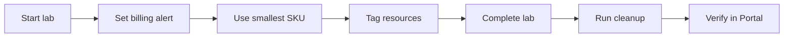

# Cost and Safety Guide

A practical reference for **avoiding surprise Azure bills** and **keeping your subscription secure** throughout this course.

**Default lab region:** `southeastasia` (Southeast Asia)

---

## 1. Core Principle

> **If a resource exists in Azure, it probably costs money.**

Your job as a DevOps learner is to:

1. Create only what the lab requires
2. Use the **smallest** size that works
3. **Delete everything** when the lab ends (resource group delete is the nuclear option)
4. Never commit credentials to Git

---

## 2. Azure Free Account — What It Actually Means

| Type | Meaning |
|------|---------|
| **Azure Free Account / Free trial** | New accounts: free credits (commonly ~$200 for 30 days) plus limited always-free services |
| **Always Free** | Small monthly limits that never expire (e.g. limited Blob storage, limited Functions) |
| **Short trials** | Time-limited trials for specific services |

**Free trial / Free Account does NOT cover everything in this course.**

| Service | Free trial / Free Account note |
|---------|--------------------------------|
| VM `Standard_B1s` | Often covered by free credits; still stop/delete when done |
| Blob Storage | Limited free storage (limits apply) |
| MySQL Flexible Server | Limited — check current offers; often **charges quickly** |
| **Load Balancer** | **Not Free Account friendly** — hourly / capacity charge |
| **Application Gateway** | **Avoid in beginner labs** — more expensive than Basic Load Balancer |
| **NAT Gateway** | **Never use in beginner labs** — expensive |
| **Container Apps** | Limited; still costs at scale |

Always check: [Azure Free Account](https://azure.microsoft.com/free/)

---

## 3. Set Up Billing Alerts (Do This on Day 1)

See [00-course-setup/azure-subscription-safety.md](00-course-setup/azure-subscription-safety.md).

| Alert | Suggested amount |
|-------|------------------|
| Cost Management budget | $10 USD/month (training) |
| Thresholds | 80% and 100% email |

Review weekly: **Cost Management + Billing** → **Cost analysis** → filter by service.

---

## 4. Cost Estimate by Module

Approximate if **not** fully covered by free credits and left running **24 hours**:

| Module | Main resources | Risk if forgotten |
|--------|----------------|-------------------|
| 03 Entra/RBAC | None | Free |
| 03 VM | `Standard_B1s` | ~$8–15/month |
| 03 VNet | VNet free; VM costs | VM charges |
| 03 Managed Disks | Disk GB-month | Cents–$1+ |
| 03 Blob | Storage + requests | Low if small |
| 03 MySQL | Flexible Server + storage | **$15–30+/month** |
| 03 LB+VMSS | Load Balancer + 2× VM | **$25–45+/month** |
| 03 Container Apps | Container Apps + ACR | **$20–35+/month** |
| 04–05 CLI/Terraform | Same as Portal | Same risks |
| 06 Capstone | Combined | Medium–high |

**Rule:** Run cleanup **same day** as each lab.

**Between modules:** Portal → CLI → Terraform repeats the same services. Run [final-cleanup-checklist.md](06-capstone-project/final-cleanup-checklist.md) (or verify zero lab resources) before starting the next module — otherwise you pay for duplicate stacks.

**Console exception:** Defer Lab 02 VM cleanup until after Lab 04 Managed Disks — see [03-console-labs/README.md](03-console-labs/README.md).

---

## 5. Highest-Cost Mistakes (Student Hall of Fame)

| Mistake | Why it hurts |
|---------|--------------|
| Forgotten MySQL Flexible Server | Bills 24/7 — often #1 surprise |
| Load Balancer left running | Hourly / capacity charge even with low traffic |
| Application Gateway created | Higher cost than needed for labs — avoid |
| NAT Gateway created | Hourly + per-GB — avoid in this course |
| Multiple VMs from VMSS | 2× or more compute cost |
| Managed disks after VM delete | Unattached disks still charge |
| Public IP not deleted | Charge when not attached / unused |
| Wrong region resources | Hard to find; keeps billing |
| Snapshots accumulating | Small but never-ending storage cost |

---

## 6. Resource Cleanup Quick Reference

| Service | How to stop charges |
|---------|---------------------|
| **VM** | Delete VM (not just Stop/deallocate if lab done) |
| **Managed Disks** | Delete disks; delete snapshots |
| **Public IP** | Delete if unused |
| **MySQL Flexible Server** | Delete server; delete backups if billed |
| **Load Balancer** | Delete load balancer |
| **Backend pool / health probe** | Delete after Load Balancer |
| **VM Scale Set** | Delete scale set (removes instances) |
| **LB base VM** | Delete base image VM after image created (Console lab 07) |
| **Container Apps** | Delete app → environment |
| **ACR** | Delete images → registry |
| **Log Analytics** | Delete workspace tied to `devops-lab-*` if created |
| **Blob / Storage account** | Empty containers → delete storage account |
| **NAT Gateway** | Delete NAT → release public IP |
| **Custom VNet** | Delete NICs, NSGs, subnets, VNet (order matters) |
| **Resource Group** | **Nuclear option:** delete the whole RG and everything in it |

Detailed checklists:

- Per lab: each `03-console-labs/*/cleanup.md`
- End of course: [06-capstone-project/final-cleanup-checklist.md](06-capstone-project/final-cleanup-checklist.md)

---

## 7. Tagging for Cost Control

Required tags (see [lab-naming-convention.md](00-course-setup/lab-naming-convention.md)):

```
Project     = azure-basic
Owner       = <yourname>
Environment = training
```

In **Cost analysis**, group by tag `Owner` or `Project` to see your spend.

---

## 8. Credential Safety

| Never commit | Store instead |
|--------------|---------------|
| Service principal secret / client secret | Azure Key Vault or local env — not Git |
| `.pem` / SSH private keys | `~/.ssh/` |
| `terraform.tfstate` | Local only (sensitive) |
| `terraform.tfvars` with passwords | Local only |
| Published credentials CSV | Password manager, then delete file |

Repo [`.gitignore`](.gitignore) blocks common mistakes.

If you **accidentally commit a secret**:

1. **Revoke/delete credential immediately** in Entra ID / App registrations
2. Create new credentials
3. Remove from Git history (or rotate and treat as compromised)
4. Check Activity Log / Microsoft Entra sign-in logs for unauthorized actions

---

## 9. Network Security vs Cost

| Practice | Cost impact | Security |
|----------|-------------|----------|
| SSH from **My IP** only | Free | ✅ Good |
| SSH from `0.0.0.0/0` | Free | ❌ Bad — attacks |
| HTTP from My IP for lab | Free | ✅ OK for learning |
| Public Blob container | Free tier storage | ❌ Data leak risk |
| NAT Gateway for private subnet | **$$$** | Production pattern — not this course |

---

## 10. Region Discipline

| Do | Don't |
|----|-------|
| Use `southeastasia` for all labs | Mix regions without reason |
| Check region before create | Assume resources are "everywhere" |
| Run cleanup in **each** region used | Only check one region |

```bash
# List VMs across common regions (CLI)
for r in southeastasia eastus westeurope; do
  echo "=== $r ==="
  az vm list --query "[?location=='$r'].{Name:name,RG:resourceGroup,Power:powerState}" \
    -o table 2>/dev/null || az vm list -g devops-lab-<yourname>-rg -o table
done
```

Prefer filtering by **resource group** `devops-lab-<yourname>-rg` — that is usually faster than scanning every region.

---

## 11. Terraform State Safety

> **`terraform.tfstate` can contain sensitive values** (IPs, resource IDs, sometimes secrets).

| Rule | Action |
|------|--------|
| Do not commit state | In `.gitignore` |
| One state per lab folder | Do not share state casually |
| After `destroy` | State should show zero resources |
| Production | Use remote backend (e.g. Azure Storage) + encryption (advanced) |

---

## 12. Daily Lab Cost Habits



| Before lab | After lab |
|------------|-----------|
| Confirm region | Delete resources / resource group |
| Confirm budget alert | Check Cost analysis tomorrow |
| Read cost warning in README | Run `terraform destroy` if used |

---

## 13. When to Ask for Help

Contact instructor if:

- Bill exceeds expected amount suddenly
- Cannot find resource to delete
- `terraform destroy` fails halfway
- Suspect subscription compromise (unknown resources, unknown API calls)

---

## 14. Quick Rules Summary

1. **Always run cleanup** at end of every lab
2. **Delete** VMs — don't leave running overnight (deallocate still bills disks)
3. **Delete MySQL and Load Balancer** same day — highest risk
4. **No NAT Gateway** in beginner labs
5. **Use `Standard_B1s` / smallest MySQL SKU**
6. **Region:** `southeastasia` unless told otherwise
7. **Never commit** keys, `.pem`, or `tfstate`
8. **MFA on Entra** and lab user
9. **Cost Management budget** at $10 (or agreed amount)
10. **Final sweep:** [final-cleanup-checklist.md](06-capstone-project/final-cleanup-checklist.md) — or delete the lab resource group

---

## References to Verify

- [Azure Pricing Calculator](https://azure.microsoft.com/pricing/calculator/)
- [Azure Cost Management](https://azure.microsoft.com/products/cost-management)
- [Azure Free Account](https://azure.microsoft.com/free/)
- [Azure Security Best Practices](https://learn.microsoft.com/azure/security/fundamentals/best-practices-and-patterns)

---

**Related:** [00-course-setup/azure-subscription-safety.md](00-course-setup/azure-subscription-safety.md) | [lab-naming-convention.md](00-course-setup/lab-naming-convention.md)
