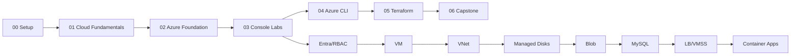

# Course Roadmap

Phase-wise learning path for **Azure Basic for DevOps Professionals**.

## Overview

| Phase | Module | Focus | Est. Time | Cost Risk |
|-------|--------|-------|-----------|-----------|
| 0 | [00-course-setup](00-course-setup/) | Prerequisites, subscription safety, naming | 1–2 hours | Low |
| 1 | [01-cloud-fundamentals](01-cloud-fundamentals/) | Cloud theory and pricing models | 3–4 hours | None (theory) |
| 2 | [02-azure-foundation](02-azure-foundation/) | Azure architecture, security, frameworks | 4–5 hours | None (theory) |
| 3 | [03-console-labs](03-console-labs/) | Portal hands-on (Entra → Container Apps) | 20–25 hours | Medium–High |
| 4 | [04-azure-cli](04-azure-cli/) | CLI setup + repeat console labs | 10–12 hours | Medium–High |
| 5 | [05-terraform](05-terraform/) | IaC theory + repeat labs in Terraform | 12–15 hours | Medium–High |
| 6 | [06-capstone-project](06-capstone-project/) | End-to-end projects | 8–10 hours | Medium |

**Total estimated time:** ~60–70 hours (classroom + self-study)

---

## Phase 0 — Course Setup

| # | Topic | File | Type |
|---|-------|------|------|
| 0.1 | Student prerequisites | [student-prerequisites.md](00-course-setup/student-prerequisites.md) | Read |
| 0.2 | Azure subscription safety | [azure-subscription-safety.md](00-course-setup/azure-subscription-safety.md) | Read |
| 0.3 | Lab naming convention | [lab-naming-convention.md](00-course-setup/lab-naming-convention.md) | Read |

---

## Phase 1 — Cloud Fundamentals

| # | Topic | File | Type |
|---|-------|------|------|
| 1.1 | What is cloud computing? | [01-what-is-cloud.md](01-cloud-fundamentals/01-what-is-cloud.md) | Theory |
| 1.2 | SaaS, PaaS, IaaS | [02-saas-paas-iaas.md](01-cloud-fundamentals/02-saas-paas-iaas.md) | Theory |
| 1.3 | Public, private, hybrid cloud | [03-public-private-hybrid-cloud.md](01-cloud-fundamentals/03-public-private-hybrid-cloud.md) | Theory |
| 1.4 | On-premises vs cloud | [04-on-prem-vs-cloud.md](01-cloud-fundamentals/04-on-prem-vs-cloud.md) | Theory |
| 1.5 | Cloud pricing basics | [05-cloud-pricing-basics.md](01-cloud-fundamentals/05-cloud-pricing-basics.md) | Theory |
| 1.6 | Diagrams reference | [diagrams.md](01-cloud-fundamentals/diagrams.md) | Reference |

---

## Phase 2 — Azure Foundation

| # | Topic | File | Type |
|---|-------|------|------|
| 2.1 | Azure global infrastructure | [01-azure-global-infrastructure.md](02-azure-foundation/01-azure-global-infrastructure.md) | Theory |
| 2.2 | Region, AZ, edge location | [02-region-az-edge-location.md](02-azure-foundation/02-region-az-edge-location.md) | Theory |
| 2.3 | Well-Architected Framework | [03-azure-well-architected-framework.md](02-azure-foundation/03-azure-well-architected-framework.md) | Theory |
| 2.4 | Cloud Adoption Framework | [04-azure-cloud-adoption-framework.md](02-azure-foundation/04-azure-cloud-adoption-framework.md) | Theory |
| 2.5 | Shared responsibility model | [05-shared-responsibility-model.md](02-azure-foundation/05-shared-responsibility-model.md) | Theory |
| 2.6 | Basic Azure security | [06-basic-azure-security.md](02-azure-foundation/06-basic-azure-security.md) | Theory |
| 2.7 | Diagrams reference | [diagrams.md](02-azure-foundation/diagrams.md) | Reference |

---

## Phase 3 — Console Labs

Same service order for Portal, CLI, and Terraform modules.

| # | Lab | Lessons | Est. Time | Cleanup |
|---|-----|---------|-----------|---------|
| 3.1 | [Entra ID + RBAC Basics](03-console-labs/01-entra-rbac-basics/) | Subscription owner vs lab user, create user, Contributor role | 2–3 hrs | [cleanup.md](03-console-labs/01-entra-rbac-basics/cleanup.md) |
| 3.2 | [VM Default VNet](03-console-labs/02-vm-default-vnet/) | Launch VM, SSH, nginx, NSG | 3–4 hrs | [cleanup.md](03-console-labs/02-vm-default-vnet/cleanup.md) |
| 3.3 | [Custom VNet + VM](03-console-labs/03-custom-vnet-vm/) | VNet, subnets, routing, NSG | 4–5 hrs | [cleanup.md](03-console-labs/03-custom-vnet-vm/cleanup.md) |
| 3.4 | [Managed Disks](03-console-labs/04-managed-disks/) | Attach disk, mount, snapshot | 2–3 hrs | [cleanup.md](03-console-labs/04-managed-disks/cleanup.md) |
| 3.5 | [Blob Storage](03-console-labs/05-blob-storage/) | Storage account, containers, versioning, access | 2–3 hrs | [cleanup.md](03-console-labs/05-blob-storage/cleanup.md) |
| 3.6 | [MySQL](03-console-labs/06-mysql/) | MySQL Flexible Server, connect from VM, backup | 3–4 hrs | [cleanup.md](03-console-labs/06-mysql/cleanup.md) |
| 3.7 | [Load Balancer + VMSS](03-console-labs/07-load-balancer-vmss/) | Image, Load Balancer, VM Scale Sets, HA test | 4–5 hrs | [cleanup.md](03-console-labs/07-load-balancer-vmss/cleanup.md) |
| 3.8 | [Container Apps](03-console-labs/08-container-apps/) | ACR, Container Apps environment, app + ingress | 4–5 hrs | [cleanup.md](03-console-labs/08-container-apps/cleanup.md) |

---

## Phase 4 — Azure CLI

| # | Topic | File | Type |
|---|-------|------|------|
| 4.1 | CLI prerequisites | [01-cli-prerequisites.md](04-azure-cli/01-cli-prerequisites.md) | Setup |
| 4.2 | Install CLI (Windows/Git Bash) | [02-install-azure-cli-windows-gitbash.md](04-azure-cli/02-install-azure-cli-windows-gitbash.md) | Setup |
| 4.3 | Create service principal / login | [03-create-service-principal.md](04-azure-cli/03-create-service-principal.md) | Setup |
| 4.4 | Configure defaults | [04-azure-configure-defaults.md](04-azure-cli/04-azure-configure-defaults.md) | Setup |
| 4.5 | Command cheatsheet | [05-cli-command-cheatsheet.md](04-azure-cli/05-cli-command-cheatsheet.md) | Reference |
| 4.6 | CLI labs overview | [06-cli-labs-same-order-as-console.md](04-azure-cli/06-cli-labs-same-order-as-console.md) | Labs |

**CLI command guides** (mirror console lab order):

| Lab | File |
|-----|------|
| VM Default VNet | [commands/vm-default-vnet.md](04-azure-cli/commands/vm-default-vnet.md) |
| Custom VNet VM | [commands/custom-vnet-vm.md](04-azure-cli/commands/custom-vnet-vm.md) |
| Managed Disks | [commands/managed-disks.md](04-azure-cli/commands/managed-disks.md) |
| Blob Storage | [commands/blob-storage.md](04-azure-cli/commands/blob-storage.md) |
| MySQL | [commands/mysql.md](04-azure-cli/commands/mysql.md) |
| Load Balancer + VMSS | [commands/lb-vmss.md](04-azure-cli/commands/lb-vmss.md) |
| Container Apps | [commands/container-apps.md](04-azure-cli/commands/container-apps.md) |

---

## Phase 5 — Terraform

| # | Topic | File | Type |
|---|-------|------|------|
| 5.1 | Terraform theory | [01-terraform-theory.md](05-terraform/01-terraform-theory.md) | Theory |
| 5.2 | Install Terraform | [02-install-terraform-windows-gitbash.md](05-terraform/02-install-terraform-windows-gitbash.md) | Setup |
| 5.3 | Provider, backend, state | [03-provider-backend-state.md](05-terraform/03-provider-backend-state.md) | Theory |
| 5.4 | Terraform workflow | [04-terraform-workflow.md](05-terraform/04-terraform-workflow.md) | Theory |
| 5.5 | Variables, outputs, tfvars | [05-variable-output-tfvars.md](05-terraform/05-variable-output-tfvars.md) | Theory |
| 5.6 | Terraform labs overview | [06-terraform-labs-same-order-as-console.md](05-terraform/06-terraform-labs-same-order-as-console.md) | Labs |

**Terraform lab folders** (mirror console lab order):

| Lab | Folder |
|-----|--------|
| VM Default VNet | [labs/01-vm-default-vnet/](05-terraform/labs/01-vm-default-vnet/) |
| Custom VNet VM | [labs/02-custom-vnet-vm/](05-terraform/labs/02-custom-vnet-vm/) |
| Managed Disks | [labs/03-managed-disks/](05-terraform/labs/03-managed-disks/) |
| Blob Storage | [labs/04-blob-storage/](05-terraform/labs/04-blob-storage/) |
| MySQL | [labs/05-mysql/](05-terraform/labs/05-mysql/) |
| Load Balancer + VMSS | [labs/06-lb-vmss/](05-terraform/labs/06-lb-vmss/) |
| Container Apps | [labs/07-container-apps/](05-terraform/labs/07-container-apps/) |

---

## Phase 6 — Capstone Projects

| # | Project | File | Skills Used |
|---|---------|------|-------------|
| 6.1 | Static website on Blob Storage | [project-01-static-website-blob.md](06-capstone-project/project-01-static-website-blob.md) | Blob Storage, Entra/RBAC, Portal/CLI/Terraform |
| 6.2 | VM nginx in custom VNet | [project-02-vm-nginx-custom-vnet.md](06-capstone-project/project-02-vm-nginx-custom-vnet.md) | VNet, VM, NSG |
| 6.3 | Container Apps web app with ACR | [project-03-container-apps-with-acr.md](06-capstone-project/project-03-container-apps-with-acr.md) | Container Apps, ACR, Docker |
| 6.4 | Final cleanup | [final-cleanup-checklist.md](06-capstone-project/final-cleanup-checklist.md) | All modules |

---

## Learning Progression Diagram

---

## Instructor Notes

- **Teach theory before each lab** — lesson files are ordered theory → practice.
- **One region** — default `southeastasia`; students change only if agreed.
- **Cleanup is mandatory** — every lab ends with a cleanup section. Deleting the resource group is the nuclear option.
- **No real credentials in Git** — use placeholders only in all examples.
